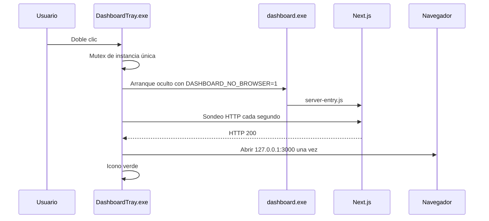
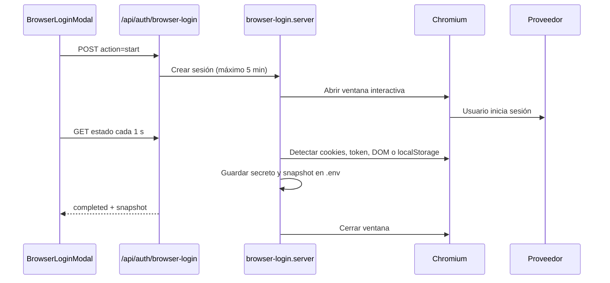

# Arquitectura y flujos

## Visión general

Dashboard_Uso_APIs es una aplicación Next.js 14 App Router de una sola página. La interfaz corre principalmente en el cliente; las credenciales y las llamadas a proveedores pasan por rutas locales del servidor.

```mermaid
flowchart TD
    UI[app/page.tsx y components] --> STORAGE[lib/storage.ts]
    STORAGE --> KEYS[/api/keys]
    STORAGE --> USAGE[/api/usage]
    UI --> LOGIN[/api/auth/browser-login]
    KEYS --> ENV[.env local]
    USAGE --> FETCHERS[lib/usage/*.server.ts]
    LOGIN --> PLAYWRIGHT[Chromium interactivo]
    FETCHERS --> PROVIDERS[APIs y consolas oficiales]
    PLAYWRIGHT --> PROVIDERS
```

## Capas

| Capa | Archivos principales | Responsabilidad |
|---|---|---|
| Presentación | `app/page.tsx`, `components/` | Tarjetas, resúmenes, ajustes, orden manual y estados. |
| Modelo | `types/api.ts`, `lib/providers.ts` | Tipos y capacidades declaradas por proveedor. |
| Persistencia cliente | `lib/storage.ts` | Configuración no sensible en `localStorage` y llamadas a la API local. |
| API local | `app/api/**/route.ts` | Credenciales, uso y sesiones de navegador. |
| Integraciones | `lib/usage/*.server.ts` | Consultas reales, normalización y errores por proveedor. |
| Automatización web | `lib/browser-login.server.ts` | Login interactivo, captura de sesión y snapshots. |
| Empaquetado | `launcher.js`, `server-entry.js`, `inspector-shim.js`, `scripts/` | Servidor standalone, compatibilidad pkg y bandeja Windows. |

## Arranque con bandeja



`DashboardTray.exe` es el propietario del proceso `dashboard.exe`. Al pulsar **Salir**, utiliza `taskkill /T` sobre ese proceso para cerrar también el servidor hijo. Si ya había un servidor externo en el puerto, el icono puede utilizarlo, pero no debe cerrar procesos que no haya iniciado.

## Carga y refresco de datos

1. `app/page.tsx` carga configuración visual desde `localStorage`.
2. `GET /api/keys` aporta los secretos desde `.env`.
3. Las integraciones configuradas se refrescan en paralelo con `POST /api/usage`.
4. Cada fetcher devuelve `ApiUsageSnapshot` con sólo los campos realmente disponibles.
5. Los campos que el proveedor no expone se incluyen en `unavailable`; nunca se inventan valores.
6. Los snapshots visibles y preferencias vuelven a guardarse en `localStorage`, sin incluir `apiKey`.

## Inicio de sesión web



El mapa de sesiones vive en `globalThis.__browserLoginSessions` para sobrevivir a recargas de módulos del servidor. Cada sesión tiene temporizador de cinco minutos y limpieza posterior.

## Persistencia

| Ubicación | Contenido | Sensible |
|---|---|---|
| `.env` o `dist/.env` | API keys, cookies, tokens y snapshots serializados bajo `DASHBOARD_PROVIDER_KEYS`. | Sí |
| `localStorage: ai-api-dashboard-config` | Proveedores, estado y snapshots; `apiKey` se vacía antes de guardar. | No debería contener secretos |
| `localStorage: ai-api-dashboard-preferences` | Visibilidad, orden y preferencias del panel. | No |

## Empaquetado

Next.js genera `output: 'standalone'`. `dashboard.exe` contiene el runtime Node de `pkg`, pero carga `standalone/server.js` desde disco. `server-entry.js` instala primero `inspector-shim.js` porque el runtime empaquetado no expone `inspector` y Next lo requiere para su trazador.

Playwright se copia completo dentro de `standalone/node_modules`. Su CLI se resuelve desde `process.cwd()`; no se usa `require.resolve('playwright')` porque Webpack lo convertiría en un identificador numérico del bundle.
