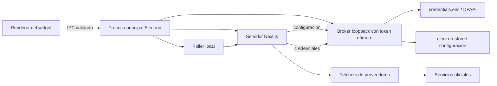
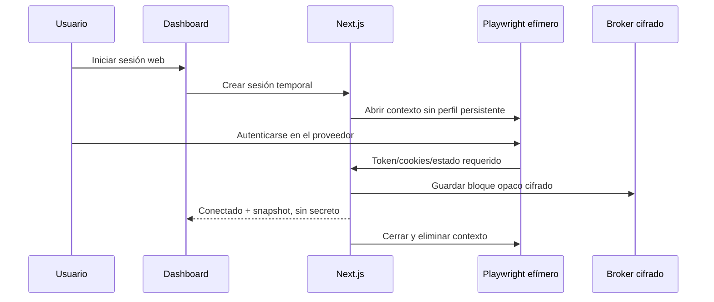

# Arquitectura

## Visión general

La aplicación combina un proceso principal Electron con un servidor Next.js standalone ligado a `127.0.0.1`. El renderer del widget no hace peticiones a proveedores ni maneja credenciales.

## Límites de confianza

| Zona | Puede conocer secretos | Persistencia |
|---|---:|---|
| Renderer del widget | No | Ninguna |
| Dashboard web | No; solo presencia de conexión | Ninguna en navegador |
| Servidor Next.js | Sí, durante la llamada necesaria | No |
| Broker Electron | Sí | `safeStorage`/DPAPI |
| Configuración Electron | No contiene secretos | JSON de `electron-store` |

El broker escucha en un puerto aleatorio de loopback y exige un bearer token aleatorio transmitido al proceso hijo mediante variables de entorno. `/api/keys` nunca devuelve el mapa real: `GET` responde únicamente `configuredIds`.

## Flujo de configuración

1. El renderer solicita ajustes mediante `ipcRenderer.invoke` a través del preload aislado.
2. El proceso principal valida rangos, temas, booleanos e IDs.
3. Las preferencias compartidas se guardan mediante `/api/config` y el broker.
4. Ajustes nativos como `alwaysOnTop`, `openAtLogin` y el estado colapsado se guardan directamente en `electron-store`.
5. El proceso principal aplica el cambio a la ventana y devuelve el estado normalizado.

## Flujo de credenciales

1. Una clave manual viaja por HTTPS hacia el proveedor solo desde el servidor; localmente entra por `PUT /api/keys`.
2. La ruta valida ID, tipo y tamaño, y actualiza el broker.
3. El broker vuelve a validar y cifra el mapa completo con DPAPI mediante una escritura temporal/renombrado.
4. El renderer conserva únicamente `connected: true`.

Si DPAPI no está disponible, el almacén rechaza lectura y escritura. No existe fallback a JSON plano.

## Login web

Algunos proveedores autentican su propia web mediante cookies o `localStorage`. Esos valores pueden formar parte del bloque cifrado porque son necesarios para reproducir una sesión, pero no se guardan en cookies del widget ni en un perfil persistente de Playwright.

## Dashboard web

- `app/page.tsx`: estado visual y coordinación.
- `lib/storage.ts`: cliente de la API local, sin `localStorage`.
- `app/api/config`: configuración no sensible.
- `app/api/keys`: escritura/borrado de credenciales y lectura de presencia.
- `app/api/usage`: valida que ID y proveedor coincidan antes de recuperar el secreto.
- `lib/usage/*.server.ts`: integración y normalización por proveedor.

Las rutas sensibles mantienen `force-dynamic` y el cliente usa `cache: 'no-store'`.

## Empaquetado

`next build` produce `.next/standalone`. `scripts/prepare-standalone.js` añade `public`, estáticos y Playwright. Electron arranca ese servidor con `ELECTRON_RUN_AS_NODE=1`. Los artefactos se generan fuera de Git y se publican mediante GitHub Releases.

La ruta `DashboardTray.exe`/`dashboard.exe` permanece como compatibilidad heredada, pero Electron es la arquitectura recomendada porque es la única que proporciona el broker DPAPI.
