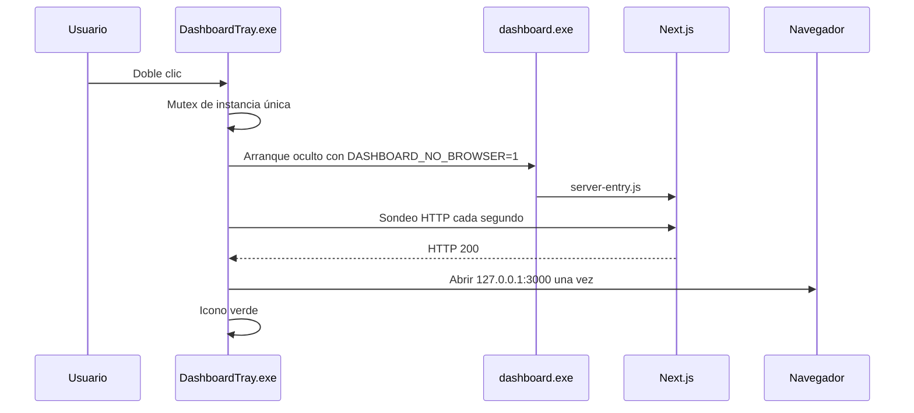
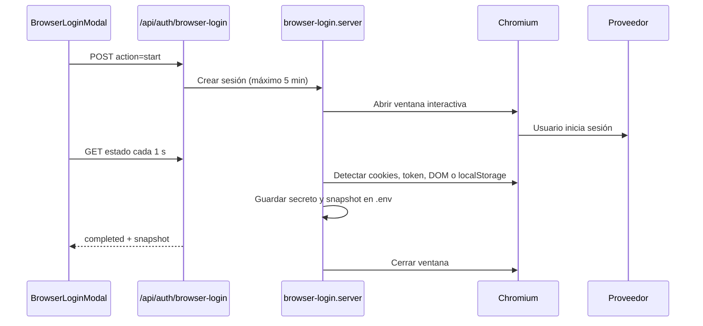
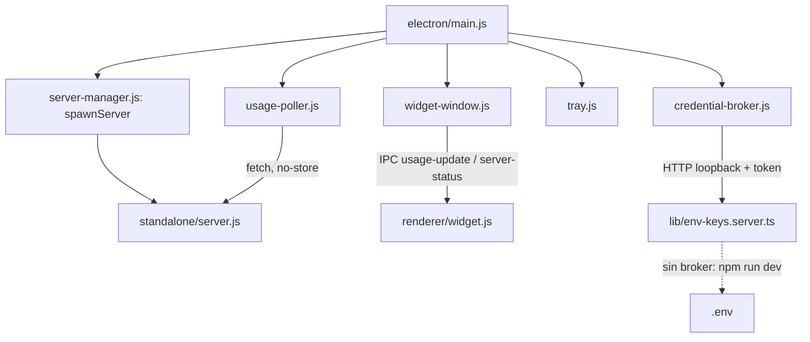

# Arquitectura y flujos

## Visión general

Dashboard_Uso_APIs es una aplicación Next.js 14 App Router de una sola página. La interfaz corre principalmente en el cliente; las credenciales y las llamadas a proveedores pasan por rutas locales del servidor.

```mermaid
flowchart TD
    UI[app/page.tsx y components] --> STORAGE[lib/storage.ts]
    STORAGE --> CONFIG[/api/config]
    STORAGE --> KEYS[/api/keys]
    STORAGE --> USAGE[/api/usage]
    UI --> LOGIN[/api/auth/browser-login]
    CONFIG --> ENV[.env local]
    KEYS --> ENV
    USAGE --> FETCHERS[lib/usage/*.server.ts]
    LOGIN --> PLAYWRIGHT[Chromium interactivo]
    FETCHERS --> PROVIDERS[APIs y consolas oficiales]
    PLAYWRIGHT --> PROVIDERS
```

## Capas

| Capa | Archivos principales | Responsabilidad |
|---|---|---|
| Presentación | `app/page.tsx`, `components/` | Tarjetas, resúmenes, ajustes, orden manual y estados. |
| Modelo | `types/api.ts`, `lib/providers.ts` | Tipos y capacidades declaradas por proveedor. |
| Persistencia cliente | `lib/storage.ts` | Configuración y preferencias, consultando a la API local. |
| API local | `app/api/**/route.ts` | Configuración, credenciales, uso y sesiones de navegador. |
| Integraciones | `lib/usage/*.server.ts` | Consultas reales, normalización y errores por proveedor. |
| Automatización web | `lib/browser-login.server.ts` | Login interactivo, captura de sesión y snapshots. |
| Empaquetado | `launcher.js`, `server-entry.js`, `inspector-shim.js`, `scripts/` | Servidor standalone, compatibilidad pkg y bandeja Windows. |

## Arranque con bandeja



`DashboardTray.exe` es el propietario del proceso `dashboard.exe`. Al pulsar **Salir**, utiliza `taskkill /T` sobre ese proceso para cerrar también el servidor hijo. Si ya había un servidor externo en el puerto, el icono puede utilizarlo, pero no debe cerrar procesos que no haya iniciado.

## Carga y refresco de datos

1. `app/page.tsx` carga configuración visual y secreta combinando `/api/config` y `/api/keys` (ambos en `.env`).
2. Las integraciones configuradas se refrescan en paralelo con `POST /api/usage`.
4. Cada fetcher devuelve `ApiUsageSnapshot` con sólo los campos realmente disponibles.
4. Los snapshots visibles y preferencias se guardan en `.env` (vía `/api/config`), asegurando que las sesiones se mantengan independientemente del navegador o equipo usado.

## Inicio de sesión web



El mapa de sesiones vive en `globalThis.__browserLoginSessions` para sobrevivir a recargas de módulos del servidor. Cada sesión tiene temporizador de cinco minutos y limpieza posterior.

## Persistencia

| Ubicación | Contenido | Sensible |
|---|---|---|
| `.env` o `dist/.env` | Configuración completa: API keys bajo `DASHBOARD_PROVIDER_KEYS`, proveedores bajo `DASHBOARD_CONFIG`, y preferencias bajo `DASHBOARD_PREFERENCES`. Todo serializado en Base64. | Sí (claves y sesiones) |
| `localStorage: ai-api-dashboard-*` | Respaldo y migración local. Utilizado solo como fallback inicial. | No |

## Empaquetado

Next.js genera `output: 'standalone'`. `dashboard.exe` contiene el runtime Node de `pkg`, pero carga `standalone/server.js` desde disco. `server-entry.js` instala primero `inspector-shim.js` porque el runtime empaquetado no expone `inspector` y Next lo requiere para su trazador.

Playwright se copia completo dentro de `standalone/node_modules`. Su CLI se resuelve desde `process.cwd()`; no se usa `require.resolve('playwright')` porque Webpack lo convertiría en un identificador numérico del bundle.

## Widget de escritorio (Electron)

Vía alternativa a `DashboardTray.exe`, en `electron/`. No toca ninguna de las capas anteriores (proveedores, login web, rutas API) — solo cambia el *shell* que arranca el servidor y añade una interfaz nativa.



- **`server-manager.js`** spawnea `standalone/server.js` con `ELECTRON_RUN_AS_NODE=1` (reutiliza el propio binario de Electron como runtime Node, sin depender de `pkg` ni de que el usuario tenga Node instalado). `waitForServer()` sondea `/api/config` (no `/`) porque en el standalone de Next, `/` está pre-renderizada y responde antes de que las rutas dinámicas terminen de inicializarse.
- **`credential-broker.js`** cifra `DASHBOARD_PROVIDER_KEYS` con `safeStorage` (DPAPI) en `credentials.enc`, dentro de `app.getPath('userData')`. Como el servidor Next.js sigue siendo un proceso Node aparte (no puede llamar a `safeStorage` directamente), expone un HTTP en loopback con un token aleatorio por arranque; `lib/env-keys.server.ts` habla con él si detecta `DASHBOARD_CRED_BROKER_URL`/`_TOKEN` en su entorno, y si no, sigue leyendo `.env` en Base64 exactamente igual que antes (así `npm run dev` sin Electron no cambia). `DASHBOARD_CONFIG` y `DASHBOARD_PREFERENCES` (no sensibles) siguen en `.env` sin pasar por el broker.
- **`usage-poller.js`** hace todo el sondeo a `/api/config`/`/api/usage` desde el proceso principal, nunca desde el renderer: la ventana del widget se carga con `loadFile()` (origen `file://`), y un `fetch()` cross-origin desde ahí sería bloqueado por CORS. Usa `cache: 'no-store'` porque el `fetch()` del proceso principal de Electron pasa por la caché HTTP de Chromium, persistida en `userData/Cache` entre reinicios.
- **`widget-window.js`** / **`renderer/`** son la ventana flotante (sin bordes, siempre visible, colapsable) — reciben los datos por IPC (`usage-update`, `server-status`), nunca por `fetch()` directo.
- **`tray.js`** pinta un único icono de bandeja (color según el peor estado entre proveedores, mismos tonos que `ProviderCard.tsx`) con menú Mostrar widget / Abrir en navegador / Reiniciar servidor / Salir.

Detalles de diseño y alternativas descartadas: [Docs/superpowers/specs/2026-08-11-electron-widget-design.md](./superpowers/specs/2026-08-11-electron-widget-design.md).
