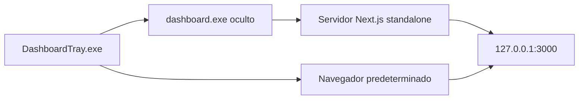

# Instalación y ejecución en Windows

## Opción recomendada: paquete ya compilado

### Requisitos del PC de destino

- Windows 10 u 11 de 64 bits.
- Acceso de escritura a la carpeta de la aplicación.
- Puerto TCP local `3000` libre.
- Navegador predeterminado.
- Conexión a Internet para los proveedores y la descarga inicial de Chromium.

No se necesita Node.js, npm, Git, Visual Studio ni PowerShell.

### Instalación limpia

1. Copia **toda** la carpeta `dist/` al PC.
2. Evita `C:\Program Files` si el usuario no tiene permisos de escritura. Una ubicación práctica es:

   ```text
   C:\Aplicaciones\Dashboard_Uso_APIs\dist\
   ```

3. Comprueba que existen `DashboardTray.exe`, `dashboard.exe`, `server-entry.js`, `inspector-shim.js` y `standalone/`.
4. Ejecuta `DashboardTray.exe`.
5. El icono aparecerá en la bandeja, posiblemente dentro del menú `^` de iconos ocultos.
6. Cuando esté verde, el panel estará disponible en `http://127.0.0.1:3000`.



### Primera conexión

1. Abre una tarjeta y pulsa **Configurar** o **Iniciar sesión web**.
2. Completa la autenticación en la ventana interactiva de Chromium si corresponde.
3. La aplicación crea o actualiza `dist/.env`.
4. Pulsa **Actualizar** si una métrica no se refresca automáticamente.

La primera operación que necesite Playwright puede descargar aproximadamente 300 MB en `%LOCALAPPDATA%\ms-playwright`.

## Migrar una instalación existente

1. En el PC antiguo, clic derecho en el icono → **Salir**.
2. Copia la carpeta `dist/` completa o, como mínimo, el nuevo paquete más el `dist/.env` antiguo.
3. Transporta `.env` por un canal privado.
4. Ejecuta `DashboardTray.exe` en el nuevo PC.
5. Repite el inicio de sesión web si el proveedor ha invalidado la sesión por cambio de equipo.

## Inicio automático con Windows

1. Pulsa `Win + R`.
2. Escribe `shell:startup` y pulsa Intro.
3. Crea allí un acceso directo a `DashboardTray.exe`.
4. No muevas sólo el ejecutable: el acceso directo debe apuntar al archivo dentro de la carpeta `dist/` completa.

Para desactivarlo, elimina únicamente ese acceso directo.

## Windows SmartScreen y seguridad

Los ejecutables generados localmente no reciben la marca de descarga de Internet. Si se descargan como ZIP desde Internet o se copian desde un origen que Windows considere no confiable, SmartScreen puede advertir porque los binarios no tienen una firma de una autoridad pública.

- No se requiere desactivar Defender ni la política de PowerShell.
- No añadas exclusiones globales de antivirus.
- Para distribución corporativa sin avisos se necesita firma de código con un certificado reconocido o una política de confianza administrada.
- El certificado autofirmado de `scripts/sign-exe.ps1` sólo es útil en equipos donde se instale explícitamente como confiable; no evita Smart App Control.

## Instalación desde código fuente

Para desarrollo, clona o copia el repositorio a un disco NTFS local y ejecuta:

```powershell
npm ci
npm run dev
```

Abre `http://localhost:3000`. El `.env` de desarrollo vive en la raíz del repositorio.

> No se recomienda ejecutar `npm run dev` desde una unidad SMB/NAS. El watcher de Next.js puede quedar escuchando el puerto sin llegar a responder.
