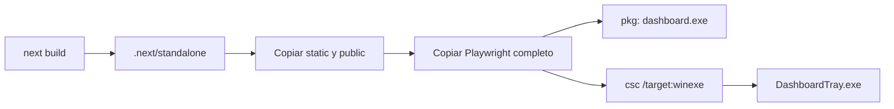
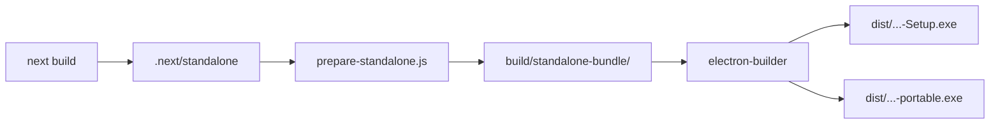

# Compilación y empaquetado Windows

## Resultado

`npm run exe` ejecuta `next build` y después `scripts/build-exe.js`.

```text
dist/
├── DashboardTray.exe
├── dashboard.exe
├── server-entry.js
├── inspector-shim.js
├── .env_example
└── standalone/
```

## Etapas



### 1. Next.js standalone

`next.config.js` usa `output: 'standalone'`. El empaquetador copia:

- `.next/standalone`;
- `.next/static` a `standalone/.next/static`;
- `public/` a `standalone/public`;
- los paquetes completos `playwright` y `playwright-core`.

Next no copia `public` y static automáticamente al standalone; omitir este paso deja la interfaz sin logos o assets.

### 2. Servidor `dashboard.exe`

`@yao-pkg/pkg` compila `launcher.js` para `node22-win-x64`. El ejecutable:

- verifica que `standalone/server.js` exista;
- usa `127.0.0.1:3000` por defecto;
- evita iniciar otro servidor si el puerto ya responde;
- lanza `server-entry.js` con el `.env` situado junto al ejecutable;
- abre el navegador salvo que reciba `DASHBOARD_NO_BROWSER=1`.

Los callbacks de sondeo se protegen para que timeout y error no abran múltiples pestañas.

### 3. Compatibilidad de `inspector`

El runtime de `pkg` no ofrece `inspector`, pero Next lo carga en su trazador. `server-entry.js` requiere primero `inspector-shim.js` y después el servidor standalone.

### 4. Playwright

El navegador Chromium no se incorpora al repositorio ni al paquete. Se descarga bajo demanda. La CLI se localiza en:

```text
<cwd standalone>/node_modules/playwright/cli.js
```

No uses `path.dirname(require.resolve('playwright'))` dentro de código compilado por Next: Webpack puede sustituir la resolución por un id numérico y provocar `The "path" argument must be of type string`.

### 5. Bandeja `DashboardTray.exe`

`scripts/tray-launcher.cs` se compila con el `csc.exe` de .NET Framework incluido en Windows:

- `/target:winexe`: sin consola;
- `/platform:anycpu`;
- referencias a `System`, `System.Drawing` y `System.Windows.Forms`.

El PC de destino no necesita el compilador. El icono crea una instancia única mediante mutex y controla el proceso del servidor.

## Compilar desde una unidad NAS

No es fiable. Next puede fallar al crear o bloquear `.next` en SMB. Procedimiento recomendado:

1. copia el código a una carpeta temporal NTFS local;
2. ejecuta `npm ci` y `npm run exe` allí;
3. detén el paquete activo;
4. copia el nuevo `dist/` al destino;
5. conserva el `dist/.env` operativo;
6. arranca `DashboardTray.exe` y valida HTTP 200.

## Firma

`scripts/sign-exe.ps1` ofrece firma autofirmada para laboratorio, pero no equivale a una firma pública con reputación. Para releases corporativas, firma ambos ejecutables con un certificado reconocido y publica checksums.

## Validación del paquete

- `DashboardTray.exe` permanece activo sin ventana.
- Sólo existe una instancia del icono.
- `dashboard.exe` y su hijo tampoco muestran consola.
- `GET /` devuelve 200.
- El icono pasa a verde.
- **Salir** cierra el árbol propiedad del icono.
- Las claves siguen disponibles y no aparecen en Git.

## Widget de escritorio (Electron)

`npm run electron:build` ejecuta `scripts/prepare-standalone.js` y después `electron-builder --win` (requiere `npm run build` antes, igual que la ruta anterior).



### 1. `scripts/prepare-standalone.js`

Hace la misma copia que la etapa 1 de la ruta `dashboard.exe` (`.next/standalone` + `static` + `public` + Playwright completo), pero a `build/standalone-bundle/` en vez de `dist/standalone/`. No compila ningún ejecutable — solo prepara los ficheros que `electron-builder` empaquetará vía `extraResources` (bloque `"build"` de `package.json`).

### 2. Exclusión de `electron`/`electron-store` del standalone

`next build` (con `outputFileTracingRoot` apuntando a la raíz del proyecto) arrastraba `electron`/`electron-store` completos (~350MB) al `.next/standalone`, aunque ningún route handler los importa — solo los usa `electron/main.js`, fuera del árbol que Next traza. `next.config.js` los excluye explícitamente con `experimental.outputFileTracingExcludes`. Sin esto, el bundle standalone pasa de ~27MB a ~370MB.

### 3. `electron-builder`

Configurado en el bloque `"build"` de `package.json`: genera un instalador NSIS (`oneClick: false`, permite elegir carpeta) y una versión portable, ambos para `win` x64. `extraResources` copia `build/standalone-bundle/` a `resources/standalone-bundle/` dentro del paquete; en tiempo de ejecución, `electron/main.js` (vía `standaloneDir()`) lo localiza con `process.resourcesPath` cuando `app.isPackaged` es `true`. No hay icono propio configurado todavía (`electron-builder` usa el de Electron por defecto) — pendiente cosmético.

### 4. Firma y Smart App Control

Igual que con `dashboard.exe`/`DashboardTray.exe`, el instalador y el portable no llevan firma con reputación en la nube de Microsoft. Además del aviso clásico de SmartScreen, si el PC tiene **Smart App Control** activado (`HKLM:\SYSTEM\CurrentControlSet\Control\CI\Policy!VerifiedAndReputablePolicyState = 1`), Windows puede **bloquear la ejecución por completo** (no solo avisar) — el error visible es "Una directiva de Control de aplicaciones bloqueó este archivo". `scripts/sign-exe.ps1` (firma autofirmada) no lo soluciona: SAC solo confía en firmantes con reputación en la nube, nunca en un certificado autofirmado. Para evitarlo de verdad hace falta un certificado de una CA reconocida (EV code signing).

### Validación del widget

- `npm test` (`node --test`) pasa: módulos puros de `electron/lib/` y `lib/cred-broker-client.js`.
- `npm run electron:dev` arranca con instancia única, broker de credenciales, servidor Next.js y widget con datos reales.
- `credentials.enc` en `userData` empieza por el prefijo DPAPI `v10` (no es JSON/Base64 legible).
- `npx electron-builder --win --dir` genera `dist/win-unpacked/` sin arrastrar `electron` dentro de `resources/standalone-bundle/`.
- `npm run electron:build` genera el instalador y el portable sin errores.
- **Pendiente de validar en un equipo sin Smart App Control activo (o con la app ya aprobada):** que el `.exe` final generado arranca de verdad al hacer doble clic. En la máquina donde se implementó este empaquetado, Smart App Control bloqueó la ejecución directa del binario recién compilado — la lógica de la app ya está verificada a fondo en modo `electron:dev` (mismo binario de Electron, mismo código), pero el paso final de "doble clic y funciona" no se pudo confirmar ahí.
