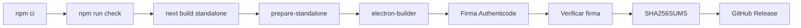

# Compilación, firma y publicación Windows

## Artefactos

`npm run electron:build` genera localmente:

```text
dist/
├── Dashboard Uso APIs-<versión>-Setup.exe
└── Dashboard Uso APIs-<versión>-portable.exe
```

`dist/` está ignorado y no se versiona. Las descargas públicas pertenecen a GitHub Releases.

## Pipeline



`scripts/prepare-standalone.js` copia `.next/standalone`, `.next/static`, `public` y los paquetes completos de Playwright. La CLI de Playwright se resuelve desde `process.cwd()/node_modules/playwright/cli.js`; no debe usarse `require.resolve('playwright')` dentro del código empaquetado por Next.

Las dependencias web (`next`, React y Playwright) se excluyen expresamente de
`app.asar`: ya están trazadas dentro del recurso standalone y duplicarlas aumenta
el tamaño y la superficie del instalador. `app.asar` conserva únicamente el
proceso Electron, sus recursos y las dependencias del proceso principal.

Durante el empaquetado se fijan fuses de Electron para impedir `runAsNode`,
opciones/inspección de Node y cargas alternativas fuera de ASAR. El servidor
Next se inicia como `utilityProcess`, por lo que no necesita relajar esos fuses.

## Build local

```powershell
npm ci
npm run check
npm run electron:build
```

Este build puede quedar sin firma y activar controles de Windows. Es adecuado para desarrollo, no para una release pública.

`npm run exe` es un alias de `electron:build`. La ruta histórica basada en
`@yao-pkg/pkg`, `dashboard.exe` y un tray C# se eliminó; mantener un único
empaquetador evita que se distribuya accidentalmente una variante sin DPAPI.

## Release firmada

Exporta el certificado reconocido como PFX/Base64 y configura:

- `WIN_CSC_LINK`
- `WIN_CSC_KEY_PASSWORD`

Después ejecuta:

```powershell
npm run release:windows
```

El script se detiene si faltan credenciales de firma, si algún ejecutable no tiene estado Authenticode `Valid` o si no se generan artefactos. Finalmente crea `dist/SHA256SUMS.txt`.

En GitHub, añade ambos valores como Actions secrets y crea un tag `v<versión>`. `.github/workflows/release-windows.yml` compila, firma, verifica y publica.

## Certificado

Para usuarios generales se necesita un certificado de firma de código emitido por una CA reconocida o Azure Trusted Signing. Para entornos corporativos, coordina además la inclusión del editor/hash en la política EDR. Un PFX autofirmado no construye reputación en SmartScreen/SAC.

### Deuda de distribución al cerrar `0.2.2`

La aplicación `0.2.2` está funcionalmente validada, pero sus artefactos locales
siguen mostrando `Authenticode: NotSigned`. Por tanto, la firma es una deuda
**bloqueante para distribución pública**, aunque no impide usar la instalación
ya probada en el equipo de referencia.

El proyecto no se considerará distribuible «en cualquier PC» hasta completar el
checklist de [cierre y reapertura](./PROJECT_CLOSURE.md). En particular, no debe
publicarse `SHA256SUMS-UNSIGNED.txt` como si sustituyera una firma: el hash
demuestra integridad respecto a un valor conocido, pero no la identidad del
editor.

## NAS/SMB

Si el repositorio vive en red, copia el código a NTFS, ejecuta allí `npm ci` y el build, y publica los artefactos resultantes. No copies `.env`, perfiles de navegador ni diagnósticos.

## Checklist de release

- [ ] Tag y `package.json` tienen la misma versión.
- [ ] `npm audit --audit-level=high` correcto.
- [ ] lint, tipos, tests y build correctos.
- [ ] instalador y portable firmados; timestamp válido.
- [ ] SHA-256 publicado.
- [ ] instalación limpia y desinstalación probadas.
- [ ] una sola instancia; bandeja y cierre completos.
- [ ] HTTP 200 en `127.0.0.1:3000`.
- [ ] panel de configuración y una integración real probados.
- [ ] ningún secreto o artefacto aparece en Git.

## Navegador de automatización

El paquete incluye las bibliotecas de Playwright, pero no una copia de Chromium
de cientos de megabytes. En producción usa Edge o Chrome instalado en Windows.
La descarga por CLI se permite solo al ejecutar desde Node en desarrollo; no se
reactiva `runAsNode` en el binario Electron.
