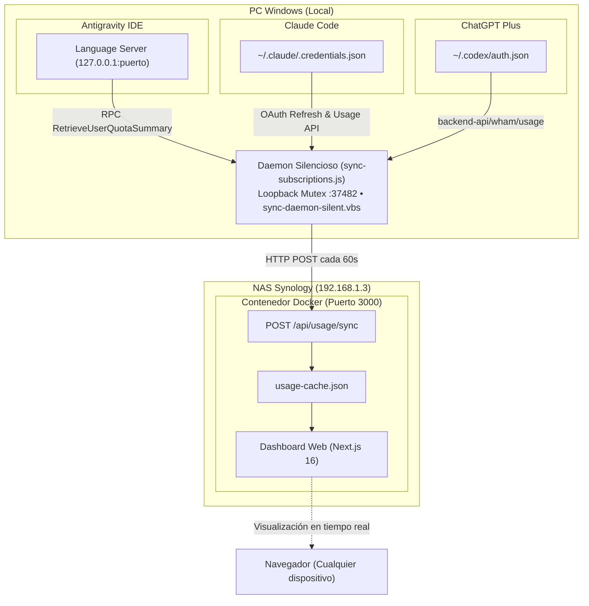

# Sincronización Automática de Suscripciones (PC Windows -> NAS Synology)

Este documento describe la arquitectura, ingeniería inversa y automatización del sistema de sincronización continua entre el PC del desarrollador (donde residen las sesiones de IA locales) y el servidor Docker en el NAS Synology (`192.168.1.3:3000`).

---

## 1. Contexto y Arquitectura Híbrida

El Dashboard web se ejecuta en un contenedor Docker 24/7 en el NAS Synology. Sin embargo, las cuotas de suscripciones y límites de consumo de los modelos de IA no están disponibles como endpoints de API estándar de pago por uso, sino asociadas a herramientas locales del desarrollador:



---

## 2. Ingeniería Inversa de Proveedores

### 2.1 Google Gemini (Antigravity IDE)

Google no ofrece un endpoint web público para consultar el estado de cuota de la suscripción a Antigravity (Google AI Pro). El propio IDE ejecuta localmente un binario de soporte:
`language_server_windows_x64.exe`.

- **Detección del proceso y puerto**:
  El script escanea los logs en `%APPDATA%\Antigravity IDE\logs\*\ls-main.log` para encontrar el puerto dinámico asignado (por ejemplo, `52976`) y el token CSRF (`--csrf_token`).
- **Endpoint RPC descubierto**:
  `/exa.language_server_pb.LanguageServerService/RetrieveUserQuotaSummary` (método idéntico al que utiliza la interfaz nativa `Settings - Models`).
- **Métricas extraídas**:
  - `gemini-weekly`: Límite semanal restante (`remainingFraction`), fecha y hora de reseteo (`resetTime`).
  - `gemini-5h`: Límite de sesión de 5 horas restante (`remainingFraction`), fecha y hora de reseteo (`resetTime`).
  - Saldo de créditos de sobreuso (`available_count` o saldo asignado).

### 2.2 Claude Pro / Claude Code

- **Credenciales locales**: Almacenadas en `%USERPROFILE%\.claude\.credentials.json`.
- **Refresco OAuth**: Si el token expira, el sincronizador utiliza el `refreshToken` para obtener un nuevo `accessToken` contra `https://claude.ai/oauth/token`.
- **Métricas extraídas** (`https://api.anthropic.com/api/organizations/{orgId}/usage`):
  - Límites de ventana de 5 horas (`five_hour_utilization`).
  - Límite semanal (`weekly_utilization`).
  - Desglose por origen: Claude Code, Chats web, Cowork.
  - Coste acumulado de créditos extra en EUR.

### 2.3 OpenAI / ChatGPT Plus

- **Credenciales locales**: Almacenadas en `%USERPROFILE%\.codex\auth.json` (provenientes de Codex Desktop / OpenAI login).
- **Métricas extraídas** (`https://chatgpt.com/backend-api/wham/usage`):
  - Ventana primaria de 3/5 horas (`primary_window.used_percent`).
  - Ventana secundaria semanal (`secondary_window.used_percent`).
  - Créditos de reseteo disponibles (`rate_limit_reset_credits.available_count`).

---

## 3. Automatización en Segundo Plano (Windows)

Para garantizar que el usuario nunca tenga que ejecutar comandos manualmente ni sufra interrupciones de ventanas de consola:

### 3.1 Lanzador Invisible (`sync-daemon-silent.vbs`)
Utiliza `WScript.Shell` con estilo de ventana `0` (completamente oculta) y redirige toda la salida a un archivo de registro:
```vbs
WshShell.Run cmd, 0, True
```
Si el script se interrumpe por algún motivo, un bucle de supervisión lo reinicia automáticamente tras 10 segundos.

### 3.2 Registro de Inicio con Windows
El script se registra en dos ubicaciones estándar del usuario:
1. **Registro de Windows**:
   `HKCU\Software\Microsoft\Windows\CurrentVersion\Run` -> `DashboardAPIs_AutoSync`
2. **Carpeta de Inicio**:
   `%APPDATA%\Microsoft\Windows\Start Menu\Programs\Startup\DashboardAPIs-Sync.vbs`

Al arrancar el equipo, el lanzador incluye una espera inteligente de hasta 60 segundos por si la unidad de red mapeada (`Z:`) tarda unos instantes en conectarse.

### 3.3 Mecanismo de Instancia Única (Mutex de Red Loopback)
Los esquemas basados únicamente en PID sufren el problema de reciclaje rápido de PIDs en Windows. Para evitar instancias duplicadas o bloqueos por archivos huérfanos:
- El daemon enlaza un servidor TCP local en `127.0.0.1:37482`.
- Si otra instancia intenta arrancar, recibe inmediatamente el error `EADDRINUSE` y sale de forma limpia.
- Si el proceso finaliza o el sistema se apaga, el kernel de Windows libera el socket TCP en el acto, garantizando que nunca se produzcan falsos bloqueos.

### 3.4 Registro y Rotación de Logs
- Ubicación: `%APPDATA%\Dashboard_Uso_APIs\sync.log`.
- Se rota automáticamente si el archivo supera 1 MB para proteger el espacio en disco.

---

## 4. Comandos y Herramientas Disponibles

| Script | Ubicación | Descripción |
|---|---|---|
| **Instalar sincronización automática** | `instalar-sincronizacion-automatica.bat` | Registra el servicio en Windows y lo arranca inmediatamente. |
| **Comprobar estado y logs** | `scripts/estado-servicio.bat` | Muestra si el servicio está activo (PID) y las últimas líneas sincronizadas. |
| **Desinstalar sincronización** | `scripts/desinstalar-inicio-automatico.bat` | Detiene el daemon y elimina las entradas de inicio automático. |
| **Sincronización manual** | `npm run sync` | Ejecuta un único ciclo de sincronización en consola. |
| **Demonio en consola** | `npm run sync:daemon` | Ejecuta el sincronizador en primer plano con logs en directo. |
