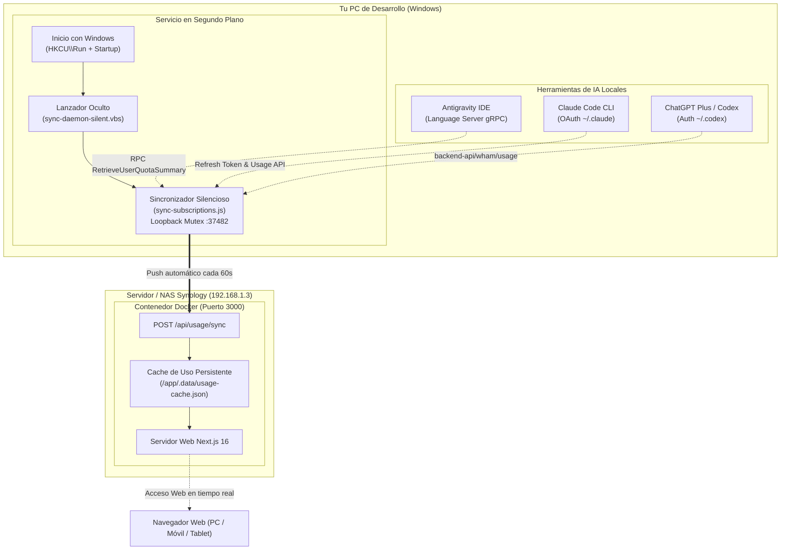

<p align="center">
  
</p>

<h1 align="center">Dashboard de Uso y Cuotas de APIs de IA</h1>

<p align="center">
  <b>Supervisión en tiempo real de consumo, costes y cuotas de suscripción de IA para desarrolladores.</b><br>
  Datos reales de <b>OpenAI / ChatGPT Plus</b>, <b>Claude Pro / Code</b>, <b>Google Gemini (Antigravity IDE)</b> y <b>DeepSeek</b>.<br>
  <i>Despliegue web 24/7 en Docker (NAS Synology), sincronizador silencioso en segundo plano y widget de escritorio Windows.</i>
</p>

<p align="center">
  <a href="https://github.com/Zambudio/Dashboard_Uso_APIs/actions/workflows/ci.yml"></a>
  
  
  
  
  <a href="./LICENSE"></a>
</p>

---

## 🚀 Novedades de la versión 0.3.0

- 🐳 **Despliegue Web 24/7 en Docker / NAS Synology**: El dashboard ahora se ejecuta como servicio web autónomo en tu red local (por ejemplo `http://192.168.1.3:3000`), accesible desde tu PC, móvil o tablet.
- ⚡ **Ingeniería Inversa de Antigravity IDE (Gemini)**: Conexión directa mediante RPC gRPC (`RetrieveUserQuotaSummary`) con el Language Server local de Antigravity en Windows. Lee con exactitud matemática el límite de 5 horas, el límite semanal, los tiempos de reseteo y los créditos de sobreuso.
- 🔄 **Sincronización Silenciosa 100% Automática**: Demonio en segundo plano para Windows sin ventanas ni consolas molestas. Arranca solo al iniciar sesión, se auto-recupera ante fallos y empuja tus métricas al NAS cada 60 segundos.
- 🔐 **Autenticación Real sin Datos Simulados**: Integración directa con las credenciales locales de Claude Code (`~/.claude/.credentials.json`), ChatGPT Plus (`~/.codex/auth.json`) y API Keys oficiales.

---

## 🏗️ Arquitectura del Sistema

El sistema implementa una arquitectura híbrida optimizada para el flujo de trabajo real con IA:



---

## 📊 Matriz de Proveedores y Métricas Reales

| Proveedor | Fuente de Datos | Métricas Monitorizadas | Actualización |
|---|---|---|:---:|
| **Google Gemini** | Language Server local de Antigravity IDE | • Límite de sesión (5 horas)<br>• Límite semanal restante (%)<br>• Tiempos exactos de reseteo<br>• Saldo de créditos de sobreuso | Automática cada 60s |
| **Claude Pro / Code** | OAuth oficial de Claude Code y organizaciones | • Límite de sesión de 5 horas (%)<br>• Límite semanal (%)<br>• Desglose por herramienta (Code, Chats, Cowork)<br>• Coste acumulado de créditos extra (€) | Automática cada 60s |
| **OpenAI / ChatGPT** | Backend API autenticada de ChatGPT Plus | • Límite de sesión primaria (%)<br>• Límite semanal secundario (%)<br>• Créditos de reseteo disponibles<br>• Saldo de créditos API ($) | Automática cada 60s |
| **DeepSeek** | API oficial de saldo y consola | • Saldo restante ($)<br>• Coste acumulado (€/$)<br>• Millones de tokens consumidos<br>• Total de peticiones realizadas | Automática / Web |

> [!NOTE]
> **Filosofía de Datos Reales:** Si un proveedor no expone una métrica o las credenciales no tienen permisos suficientes, la aplicación muestra `unavailable`. **Bajo ninguna circunstancia se inventan o simulan datos.**

---

## ⚡ Guía Rápida de Instalación

### Opción A: Despliegue en NAS Synology / Docker (Recomendado 24/7)

1. **Clona el repositorio** en tu servidor o NAS:
   ```bash
   git clone https://github.com/Zambudio/Dashboard_Uso_APIs.git
   cd Dashboard_Uso_APIs
   ```

2. **Levanta el contenedor con Docker Compose**:
   ```bash
   # En Synology NAS (Container Manager)
   sudo -n /volume1/@appstore/ContainerManager/usr/bin/docker-compose up -d --build

   # En Linux / Docker estándar
   docker compose up -d --build
   ```

3. **Accede a la interfaz web**:
   Abre en tu navegador `http://<IP_DE_TU_NAS>:3000` (por ejemplo `http://192.168.1.3:3000`).

---

### Opción B: Automatización Silenciosa en tu PC Windows

Para que el servidor del NAS reciba automáticamente las cuotas de **Antigravity**, **Claude Code** y **ChatGPT** sin que tengas que abrir consolas ni ejecutar nada a mano:

1. **Instalación con 1 Clic**:
   Haz doble clic sobre el archivo en la raíz del proyecto:
   ```
   instalar-sincronizacion-automatica.bat
   ```
   *¿Qué hace automáticamente?*
   - Registra el lanzador silencioso en `HKCU\Software\Microsoft\Windows\CurrentVersion\Run` y en tu carpeta de Inicio.
   - Arranca el servicio en segundo plano de forma 100% invisible (cero ventanas de consola).
   - Se asegura de sincronizar cada 60 segundos con el NAS.
   - Se auto-reinicia si ocurre cualquier desconexión temporal de red.

2. **Comprobar el Estado o Historial de Sincronización**:
   Haz doble clic en:
   ```
   scripts/estado-servicio.bat
   ```
   Te mostrará el estado actual (`ACTIVO`), el PID del proceso y las últimas sincronizaciones registradas en `%APPDATA%\Dashboard_Uso_APIs\sync.log`.

3. **Desactivar el Servicio**:
   Si en algún momento deseas detenerlo, ejecuta:
   ```
   scripts/desinstalar-inicio-automatico.bat
   ```

---

## 🛠️ Desarrollo Local

Si deseas modificar el código o ejecutarlo en modo desarrollo:

```powershell
# Instalar dependencias
npm ci

# Ejecutar el servidor web de desarrollo
npm run dev

# Pasar suite completa de validación (ESLint, TypeScript y Tests)
npm run typecheck
npm test
npm run check
```

---

## 📁 Documentación Especializada

Toda la documentación técnica se encuentra en el directorio [`Docs/`](./Docs/):

- [Arquitectura Detallada y Flujos](./Docs/ARCHITECTURE.md)
- [Sincronización PC -> NAS (Ingeniería Inversa y Daemon)](./Docs/SYNC_SUBSCRIPTIONS.md)
- [Despliegue con Docker y Docker Compose](./Docs/DOCKER.md)
- [Guía de Conexión SSH al NAS Synology](./Guia_Conexion_ssh_NAS.md)
- [Proveedores, Métricas y Límites](./Docs/PROVIDERS.md)
- [Modelo de Seguridad y Cifrado de Credenciales](./Docs/SECURITY.md)
- [Historial Técnico y Estado del Proyecto](./Docs/PROJECT_STATUS.md)

---

## 📄 Licencia

Este proyecto está bajo la licencia [MIT](./LICENSE).
