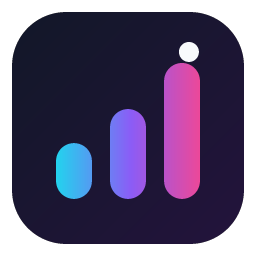
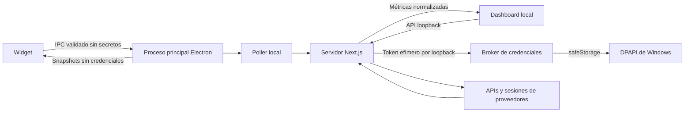

<p align="center">
  
</p>

<h1 align="center">Dashboard Uso APIs</h1>

<p align="center">
  Tu consumo de IA, visible de un vistazo.<br>
  Widget de escritorio y dashboard local para Windows, en español y sin datos simulados.
</p>

<p align="center">
  <a href="https://github.com/Zambudio/Dashboard_Uso_APIs/actions/workflows/ci.yml"></a>
  <a href="./LICENSE"></a>
</p>

---

> [!IMPORTANT]
> **Estado de distribución:** la versión `0.2.2` está compilada y validada en el equipo de desarrollo, pero sus binarios locales **no tienen firma digital** (`NotSigned`). Todavía no deben presentarse como instalables universalmente ni publicarse como release para terceros. SmartScreen, Smart App Control o un EDR corporativo pueden bloquearlos hasta que se firme la release con un certificado reconocido. Consulta [la deuda de firma](#firma-digital-pendiente).

Dashboard Uso APIs reúne la información real que cada proveedor permite consultar de **OpenAI/ChatGPT**, **Anthropic/Claude**, **Google Gemini** y **DeepSeek**. Vive en la bandeja de Windows, muestra un widget compacto sobre el escritorio y abre un dashboard local cuando necesitas más detalle.

## Dos vistas, una sola aplicación

| Widget de escritorio | Dashboard local |
|---|---|
| Resumen siempre a mano desde la bandeja de Windows | Vista completa de uso, costes, saldos y límites |
| Panel propio de configuración | Gestión de proveedores y conexiones |
| Tema, opacidad, refresco y proveedores visibles | Errores accionables en español |
| Recuperación inteligente en el monitor activo | Datos reales o `unavailable`; nunca cifras inventadas |

El widget puede iniciarse con Windows, permanecer siempre visible y recordar sus preferencias. Si queda minimizado o fuera de pantalla, el icono de bandeja lo restaura en el monitor donde se encuentra el cursor.

## Lo más importante

- **Configuración desde el propio widget:** tema, opacidad, intervalo de actualización, inicio con Windows, modo siempre visible y proveedores visibles.
- **Credenciales protegidas en Windows:** Electron usa `safeStorage` y DPAPI; los secretos quedan ligados al usuario del sistema.
- **Renderer sin secretos:** la interfaz solo sabe si una conexión está configurada. Nunca recibe claves, cookies ni tokens.
- **Sesiones web efímeras:** no se conserva un perfil de navegador persistente. Si un proveedor exige cookies o tokens, se capturan como un bloque opaco y cifrado.
- **Ejecución local:** el servidor escucha exclusivamente en `127.0.0.1`.
- **Superficie reducida:** el renderer se carga mediante un protocolo interno con una lista cerrada de recursos, sin privilegios generales para `file://`.
- **Automatización verificable:** lint, TypeScript y tests se ejecutan en [GitHub Actions](https://github.com/Zambudio/Dashboard_Uso_APIs/actions/workflows/ci.yml).

## Proveedores y datos

| Integración | Fuente | Información disponible |
|---|---|---|
| OpenAI / ChatGPT | API y sesión web, cuando el proveedor lo permite | Uso, costes, plan y saldo según los permisos reales |
| Anthropic API | API oficial | Uso y costes según los permisos de la organización |
| Claude Pro / Code | Sesión web | Límites de sesión y semanales |
| Google Gemini | API, sesión web o Antigravity IDE | Cuota en tiempo real (restante y resets de sesión/semanal), plan y disponibilidad |
| DeepSeek | API y consola web | Saldo y métricas visibles en la cuenta |

Los endpoints internos y las medidas anti-bot de los proveedores pueden cambiar. Cuando una métrica no existe, no está autorizada o no puede consultarse de forma fiable, la aplicación la representa como `unavailable`.

## Seguridad y privacidad



- Las credenciales Electron se almacenan cifradas en `%APPDATA%\dashboard-uso-apis\credentials.enc`.
- Las preferencias no sensibles se guardan por separado mediante `electron-store`.
- No se usa `localStorage` ni una cookie propia de la aplicación para persistir sesiones.
- En el modo Electron, si `safeStorage` no está disponible, la persistencia falla de forma segura.
- El `.env` se mantiene únicamente como compatibilidad para desarrollo web local y nunca debe entrar en Git.

La explicación completa está en el [modelo de seguridad](./Docs/SECURITY.md). Para comunicar una vulnerabilidad, consulta la [política de seguridad](./SECURITY.md).

## Instalación y ejecución

### Release pública para Windows

La vía prevista es descargar el instalador o el portable desde [GitHub Releases](https://github.com/Zambudio/Dashboard_Uso_APIs/releases), comprobar la firma del editor y comparar su SHA-256 con `SHA256SUMS.txt`.

**Aún no hay una release pública universalmente instalable:** los artefactos locales `0.2.2` no están firmados. No se recomienda distribuirlos, pedir excepciones al antivirus ni indicar a otros usuarios que ignoren un aviso de seguridad.

Cuando exista certificado, el proceso autorizado será:

```powershell
npm run release:windows
```

Ese flujo exige una firma Authenticode válida y genera los hashes SHA-256 antes de publicar. Más detalles en [empaquetado y firma](./Docs/PACKAGING.md) e [instalación en Windows](./Docs/INSTALLATION_WINDOWS.md).

### Desde el código fuente

Requisitos: Windows 10/11, Node.js 22.12 o posterior y npm 10 o posterior.

```powershell
git clone https://github.com/Zambudio/Dashboard_Uso_APIs.git
cd Dashboard_Uso_APIs
npm ci
npm run check
npm run electron:dev
```

`electron:dev` detecta si el repositorio está en NAS/SMB y crea automáticamente una copia de trabajo sin secretos en `%LOCALAPPDATA%\DashboardUsoAPIs\dev-worktree`. Usa el puerto `32123` y un almacén DPAPI independiente, por lo que puede convivir con una instalación abierta en el puerto `3000`.

Para ejecutar únicamente el dashboard web:

```powershell
npm run dev
```

Después abre `http://127.0.0.1:3000`. En este modo de desarrollo sin Electron, las credenciales usan el `.env` local heredado; no es la modalidad recomendada para usuarios finales.

## Arquitectura en breve

```text
electron/                 Proceso principal, bandeja, widget y broker seguro
app/ + components/        Dashboard Next.js 16 y API local
lib/usage/                Adaptadores reales para cada proveedor
lib/storage.ts            Cliente de la API local, sin localStorage
scripts/                  Staging NTFS, standalone y release firmada
Docs/                     Arquitectura, seguridad, operación y estado
```

Electron es la distribución principal. Inicia el servidor Next.js standalone como `utilityProcess`, mantiene una sola instancia en la bandeja y expone al renderer únicamente contratos IPC limitados. Consulta [Arquitectura](./Docs/ARCHITECTURE.md) para ver los flujos completos.

## Desarrollo y validación

```powershell
npm ci
npm run lint
npm run typecheck
npm test
npm run build
```

Atajo para las comprobaciones estáticas y unitarias:

```powershell
npm run check
```

Los artefactos de `dist/` no se versionan. Para generar instalador y portable localmente:

```powershell
npm run electron:build
```

Una build local puede quedar sin firma. `npm run exe` es solo un alias compatible de `electron:build`; el proyecto ya no usa los antiguos `dashboard.exe` ni `DashboardTray.exe`.

Si un build manual desde NAS/SMB falla con Watchpack, `EPERM`, error 4390 o bloqueos de `.next`, trabaja desde una copia NTFS local. `electron:dev` ya automatiza ese staging.

## Firma digital pendiente

La firma es la deuda necesaria para cerrar la distribución pública de Windows:

1. Obtener un certificado de firma de código reconocido para el mantenedor.
2. Configurar `WIN_CSC_LINK` y `WIN_CSC_KEY_PASSWORD` como secretos del workflow de release.
3. Ejecutar `npm run release:windows` y verificar la firma Authenticode tanto del instalador como del portable.
4. Publicar exclusivamente los binarios firmados junto a `SHA256SUMS.txt`.
5. Probar instalación limpia, SmartScreen/EDR, arranque, bandeja, widget y dashboard antes de declarar la release estable.

Una firma no garantiza por sí sola la reputación inmediata del editor, pero aporta identidad e integridad verificables. Una firma autofirmada no cumple el criterio de release pública de este proyecto.

## Documentación

| Quiero… | Documento |
|---|---|
| Instalar o resolver un problema | [Instalación Windows](./Docs/INSTALLATION_WINDOWS.md) · [Operación](./Docs/OPERATIONS_TROUBLESHOOTING.md) |
| Entender la seguridad | [Seguridad y credenciales](./Docs/SECURITY.md) |
| Conocer arquitectura y API | [Arquitectura](./Docs/ARCHITECTURE.md) · [API local](./Docs/API_REFERENCE.md) |
| Revisar proveedores y métricas | [Proveedores](./Docs/PROVIDERS.md) |
| Compilar y firmar | [Empaquetado](./Docs/PACKAGING.md) · [Desarrollo](./Docs/DEVELOPMENT.md) |
| Ver qué está realmente validado | [Estado del proyecto](./Docs/PROJECT_STATUS.md) · [Changelog](./CHANGELOG.md) |
| Entender el cierre y la deuda pendiente | [Cierre temporal](./Docs/PROJECT_CLOSURE.md) |
| Colaborar | [Guía de contribución](./CONTRIBUTING.md) |

## Estado actual

`0.2.2` está validada localmente con el widget, sus cuatro proveedores, el panel de configuración, el dashboard, el servidor en localhost y los fuses endurecidos. La distribución pública permanece pendiente de firma digital reconocida.

El desarrollo funcional queda cerrado temporalmente. Solo debe reabrirse de forma explícita, por una corrección de seguridad o por una rotura causada por cambios de un proveedor. El detalle verificable —incluidas limitaciones y condiciones de reapertura— vive en [PROJECT_STATUS.md](./Docs/PROJECT_STATUS.md) y [PROJECT_CLOSURE.md](./Docs/PROJECT_CLOSURE.md).

## Licencia

[MIT](./LICENSE) © 2026 Pedro Zambudio.
